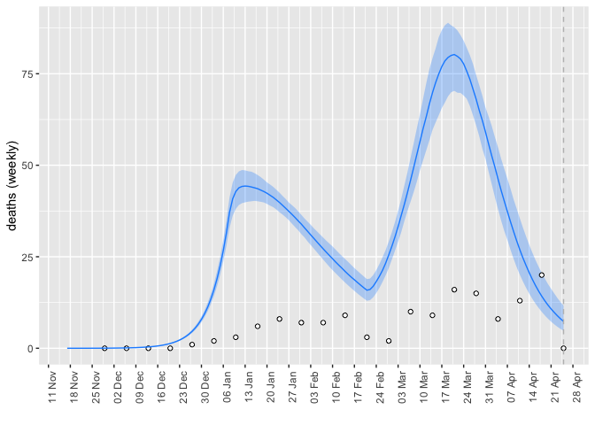
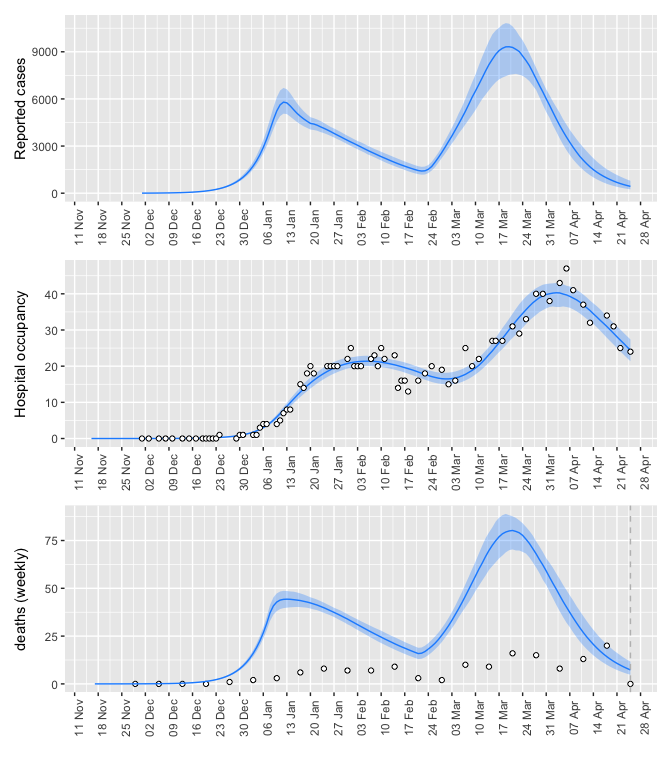

# Calibration

Optimize the following parameters at the following starting values.

```r
fit$forecast_args$opt_pars$params
```

```
##   log_beta0    logit_mu  logit_phi1 logit_delta 
##  -0.2873509   3.0785683   1.1526795  -6.9067548
```
Prefixing by `log_` or `logit_` means we are optimizing on these scales.

These parameters have the following meanings (TODO: the description for phi1 looks wrong). [AH: would be helpful to print out more parameters here, recovery rate, duration of pre-symptomatic, etc]

```
##   symbol value                                                    meaning
## 1  beta0  0.75 Baseline (non-intervention) transmission across categories
## 2  delta     0                Fraction of acute-care cases that are fatal
## 3     mu 0.956                Fraction of symptomatic cases that are mild
## 4   phi1  0.76                          Fraction of hospital cases to ICU
```

Use the following time-variation schedule for these parameters. These correspond to the implementation of Alert level 4, and the beginning of phased re-opening, and without these breakpoints the model cannot fit the data. These suggests these NPIs were important in shaping the dynamics of the early Omicron wave in NL.

```r
fit$forecast_args$time_args$params_timevar
```

```
##         Date Symbol Value Type
## 1 2022-01-04  beta0    NA  abs
## 2 2022-02-17  beta0    NA  abs
```


# Model Fit and Forecast

Here are the fitted coefficients on their original scales.

```r
coef(fit, 'fitted')
```

```
## $params
##        beta0           mu         phi1        delta 
## 5.980234e-01 9.957823e-01 2.154201e-02 1.175167e-05 
## 
## $time_params
## [1] 0.2186129 0.6337746
## 
## $nb_disp
##       death           H       cases 
##    0.280621 2178.206269    2.363543
```
The `time_params` in this particular case refer to changing transmission rate. The first change in transmission rate is lower than the baseline, consistent with restrictions being implemented on the associated date. The second change is higher, which seems to be consistent with lifting restrictions on that date.

Statements made by the government conflicted with reported cases, so I did not fit to cases at all. However, even without fitting to cases, the fit matches quite well with cases. Changes to PCR eligibility were announced on March 17, and after this time the number of PCR tests per day has declined linearly.

```r
observed_cases = filter(observed_data2,var=="report")
gC=plot_forecast(fitted_data, "report", observed_data)+ylab("Reported cases")
#+geom_point(data=observed_cases, aes(x=as.Date(date),y=value), col = "dodgerblue", alpha=0.3)
```

The fits to hospital occupancy.

```r
gH=plot_forecast(fitted_data, "H", observed_data)+ylab("Hospital occupancy")
```

Sorry, Steve, this is a messy place to put this.

```r
library(lubridate)
```

```
## 
## Attaching package: 'lubridate'
```

```
## The following objects are masked from 'package:base':
## 
##     date, intersect, setdiff, union
```

```r
deaths = filter(observed_data,var=="death")%>%group_by(week = cut(date, "week")) %>% summarise(value = sum(value))
fitted_deaths = filter(fitted_data,var=="death")

g1 = ggplot()+
  geom_ribbon(data=fitted_deaths, aes(x=as.Date(date),ymin=7*lwr, ymax=7*upr), alpha = 0.3, fill = "dodgerblue")+
  geom_point(data=deaths, aes(x=as.Date(week),y=value), fill = "white", pch=21)+
  geom_line(data=fitted_deaths,aes(x=as.Date(date), y=7*value), col = "dodgerblue")+ylab("deaths (weekly)")+ scale_x_date(date_breaks = "7 day", date_labels = "%d %b")+
  theme(axis.text.x = element_text(angle = 90),legend.position = "none")+xlab("")+geom_vline(xintercept = max(observed_data$date), col="grey", lty=2)

g1
```

```
## Warning: Removed 1 row(s) containing missing values (geom_path).
```

<!-- -->

```r
# plot_forecast(fitted_data, "death", observed_data) +
#   ylab("Deaths")+ scale_x_date(date_breaks = "7 day", date_labels = "%d %b")+
#   theme(axis.text.x = element_text(angle = 90),legend.position = "none")
```

```r
gC/gH/g1
```

<!-- -->

