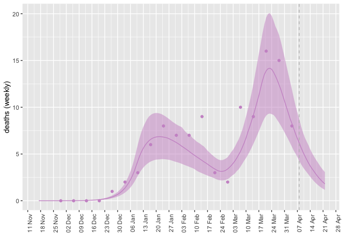

Optimize the following parameters at the following starting values.

    fit$forecast_args$opt_pars$params

    ##  log_beta0   logit_mu logit_phi1 
    ## -0.2873509  3.0785683  1.1526795

Prefixing by `log_` or `logit_` means we are optimizing on these scales.

These parameters have the following meanings (TODO: the description for
phi1 looks wrong).

    ##   symbol value                                                    meaning
    ## 1  beta0  0.75 Baseline (non-intervention) transmission across categories
    ## 2     mu 0.956                Fraction of symptomatic cases that are mild
    ## 3   phi1  0.76                          Fraction of hospital cases to ICU

Use the following time-variation schedule for these parameters.

    fit$forecast_args$time_args$params_timevar

    ##         Date Symbol Value Type
    ## 1 2022-01-04  beta0    NA  abs
    ## 2 2022-02-17  beta0    NA  abs
    ## 3 2022-03-14  beta0    NA  abs

Here are the fitted coefficients on their original scales.

    coef(fit, 'fitted')

    ## $params
    ##     beta0        mu      phi1 
    ## 0.5721508 0.9970789 0.2295066 
    ## 
    ## $time_params
    ## [1] 0.1948662 0.5089257 0.1679335
    ## 
    ## $nb_disp
    ##     death         H    report 
    ## 0.2036977 6.0570224 0.5616794

The `time_params` in this particular case refer to changing transmission
rate. The first change in transmission rate is lower than the baseline,
consistent with restrictions being implemented on the associated date.
The second change is higher, which seems to be consistent with lifting
restrictions on that date.

The fits to case reports fits better to the second peak than the first.

    plot_forecast(fitted_data, "report", observed_data)+  scale_x_date(date_breaks = "7 day", date_labels = "%d %b")+
      theme(axis.text.x = element_text(angle = 90),legend.position = "none")+ylab("Reported cases")

    ## Warning: Removed 15 row(s) containing missing values (geom_path).

The fits to hospital occupancy.

    plot_forecast(fitted_data, "H", observed_data)+ylab("Hospital occupancy")+  scale_x_date(date_breaks = "7 day", date_labels = "%d %b")+
      theme(axis.text.x = element_text(angle = 90),legend.position = "none")

    ## Warning: Removed 16 rows containing missing values (geom_point).

    hospitalizations = filter(observed_data,var=="H")
    fitted_hosp = filter(fitted_data,var=="H")

    gH = ggplot()+
      geom_ribbon(data=fitted_hosp, aes(x=as.Date(date),ymin=lwr, ymax=upr), alpha = 0.5, fill = "aquamarine")+
      geom_point(data=hospitalizations, aes(x=as.Date(date),y=value), col = "aquamarine")+
      geom_line(data=fitted_hosp,aes(x=as.Date(date), y=value), col = "aquamarine")+ylab("Hospital occupancy")+ scale_x_date(date_breaks = "7 day", date_labels = "%d %b")+
      theme(axis.text.x = element_text(angle = 90),legend.position = "none")+xlab("")+geom_vline(xintercept = max(observed_data$date), col="aquamarine", lty=2)

AH: I coded g1 to show fit to weekly deaths

    library(lubridate)

    ## 
    ## Attaching package: 'lubridate'

    ## The following objects are masked from 'package:base':
    ## 
    ##     date, intersect, setdiff, union

    deaths = filter(observed_data,var=="death")%>%group_by(week = cut(date, "week")) %>% summarise(value = sum(value))
    fitted_deaths = filter(fitted_data,var=="death")

    g1 = ggplot()+
      geom_ribbon(data=fitted_deaths, aes(x=as.Date(date),ymin=7*lwr, ymax=7*upr), alpha = 0.5, fill = "plum3")+
      geom_point(data=deaths, aes(x=as.Date(week),y=value), col = "plum3")+
      geom_line(data=fitted_deaths,aes(x=as.Date(date), y=7*value), col = "plum3")+ylab("deaths (weekly)")+ scale_x_date(date_breaks = "7 day", date_labels = "%d %b")+
      theme(axis.text.x = element_text(angle = 90),legend.position = "none")+xlab("")+geom_vline(xintercept = max(observed_data$date), col="grey", lty=2)

    g1

    ## Warning: Removed 1 row(s) containing missing values (geom_path).

    # plot_forecast(fitted_data, "death", observed_data) +
    #   ylab("Deaths")+ scale_x_date(date_breaks = "7 day", date_labels = "%d %b")+
    #   theme(axis.text.x = element_text(angle = 90),legend.position = "none")
