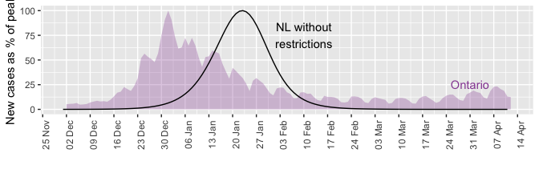

<!-- --><!-- --><!-- -->

**Figure 1. The effect of restrictions in early-January in Newfoundland and Labrador was a two-peaked BA.1 Omicron variant wave of prolonged duration that protected health care capacity.** The implementation of the Alert level 4 on January 4, 2022, and the subsequent easing of restrictions on February 14, 2022, meant that Newfoundland and Labrador has experienced a two-peaked BA.1 wave of longer duration. These restrictions helped to protect health care capacity by reducing the number of concurrent hospitalizations. With the restrictions, the total number of cases and deaths was only slightly reduced, suggesting that the predominant effect of the restrictions was to delay, rather than prevent, cases and severe illness.

Below are some awkwardly coded comparisons of cases and deaths.


```r
fitted_total_deaths = filter(fitted_data,var=="death")%>%filter(date>"2021-12-15")%>%filter(!is.na(value))%>%summarize(sum(value))

scenario_total_deaths = filter(scenario,date>"2021-12-15")%>%filter(!is.na(D))%>%summarize(sum(D))

fitted_total_cases = filter(fitted_data,var=="report")%>%filter(date>"2021-12-15")%>%filter(!is.na(value))%>%summarize(sum(value))

scenario_total_cases = filter(scenario,date>"2021-12-15")%>%filter(!is.na(report))%>%summarize(sum(report))
```

<!-- -->

**Figure 2. The BA.1 Omicron variant wave would have been similar to Ontario's had restrictions not been implemented in early January in Newfoundland and Labrador.** The simulated BA.1 Omicron wave for Newfoundland and Labrador without restrictions in early January has a similar shape to Ontario's BA.1 Omicron variant wave, with the wave beginning approximate 3 weeks later.
