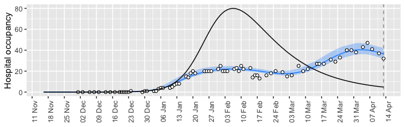
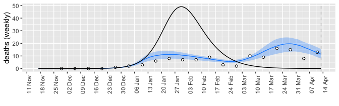
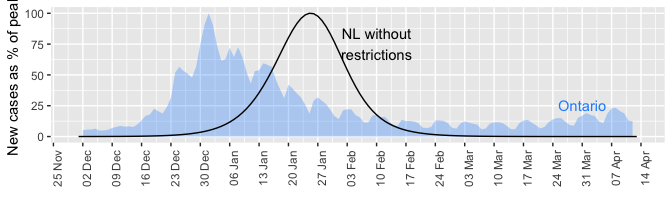

Below I try to do a counter-factual simulation assuming no Alert level 4 on January 4, 2022


```r
library(tidyr)
library(dplyr)
library(McMasterPandemic)
library(ggplot2)
library(lubridate)
library(patchwork)
setwd("/Users/ahurford/Desktop/Work/Research/Research_Projects/2022/nfld-macpan")
source('get_data.R')
source('functions.R')
fit = readRDS('initial_model/fit.rds')
fitted_data = readRDS('initial_model/fitted_data.rds')
observed_data = readRDS('initial_model/observed_data.rds')

params = read_params("PHAC.csv")
params["N"] = 522453  # nfld population
params = fix_pars(params)

# This gives me errors but then I run the line individually and it's fine
params$beta0 = as.numeric(unname(coef(fit, 'fitted')$params[1]))
params$mu = as.numeric(unname(coef(fit, 'fitted')$params[2]))
params$phi1 = as.numeric(unname(coef(fit, 'fitted')$params[3]))

end_date = max(observed_data$date)+14
#Changing from 90 to 15 improves fit substantially
start_date_offset = 15
start_date = min(observed_data$date) - start_date_offset

# The breakpoint on Jan 4 is removed
params_timevar = data.frame(
  Date = c("2022-03-14"), # dates of breakpoints
  Symbol = "beta0",                     # parameters to vary
  Value = coef(fit, 'fitted')$time_params[2],                    # NA means calibrate to data
  Type = "abs"                          # abs = change to value in Value col
)


state <- make_state(params=params)
res1 <- run_sim(params=params,params_timevar=params_timevar,state=state, start_date=start_date, end_date=end_date)
scenario = data.frame(date=res1$date,H=res1$H, D = res1$death, report = res1$report, cumRep = res1$cumRep)
```
Getting the data ready for plotting

```r
hospitalizations = filter(observed_data,var=="H")
fitted_hosp = filter(fitted_data,var=="H")

deaths = filter(observed_data,var=="death")%>%group_by(week = cut(date, "week")) %>% summarise(value = sum(value))
fitted_deaths = filter(fitted_data,var=="death")
cum_deaths = filter(observed_data,var=="death")
cum_deaths = data.frame(date = cum_deaths$date, value=cumsum(cum_deaths$value))

cases = filter(observed_data,var=="report")
fitted_cases = filter(fitted_data,var=="report")
cum_cases = filter(fitted_data,var=="cumRep")
```


<!-- --><!-- --><!-- -->

**Figure 1. The effect of the alert level 4 was to create a two-peaked wave 5 of prolonged duration in Newfoundland and Labrador.** Without the implementation of the Alert level 4 on January 4, 2022 (black lines), Newfoundland and Labrador would have experienced a wave 5 similar to other provinces: with a higher peak and dropping to prevalence in early March. With the implementation of the Alert level 4, and the subsequent easing of restrictions, i.e. phased re-opening beginning on February 14, 2022, Newfoundland and Labrador created a two-peaked wave of longer duration.


<!-- -->

**Figure 2. Despite creating a two-peaked wave, the final size for cases and deaths is only slightly reduced relative to the one-peaked wave had no Alert level 4 been implemented.** Steve are the `cumRep` values correct? Very different from observed data, but the fits are substantially overestimating cases and deaths too and this will get magnified for cumulative values.
