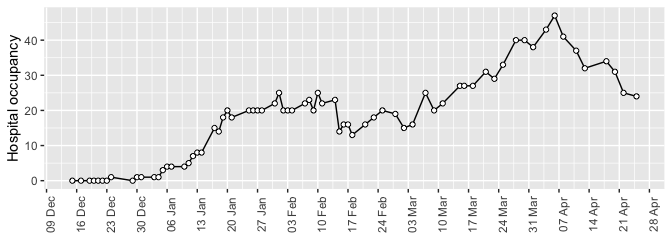
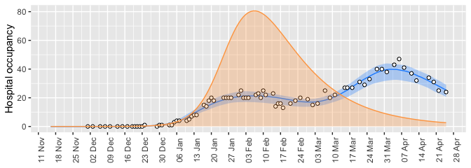

## {-}

As of April 20, the Omicron wave in Newfoundland and Labrador has two peaks. The mid-February low in reported cases is matched by a dip in both hospitalizations and weekly deaths. All three data sources agree: reported cases, hospitalizations, and deaths have a low in mid-February, which separates peaks in January and March.



### Why does Newfoundland and Labrador have a two-peaked BA.1 wave?

During the Omicron wave, testing rates may have been uneven and the availability of rapid tests may have affected reported cases. However, even when comparing an [epidemiological model](https://mac-theobio.github.io/covid-19/) to the hospital occupancy and death data _only_, a good agreement of the model with the data requires assuming that restrictions impacted the infection transmission rate.

For the modelling, I specify the dates when the transmission rate changed, but the transmission rate values are matched to agree with the hospital occupancy and death data:


```
##        dates transmission.rate
## 1     before              0.59
## 2 2022-01-04              0.22
## 3 2022-02-17              0.59
```

The date of January 4, 2022, is selected to correspond to the move to [Alert level 4](https://www.gov.nl.ca/releases/2022/health/0103n02/), and February 17, 2022, is selected to match the beginning of [phased re-opening](https://www.gov.nl.ca/releases/2022/health/0217n04/). In reality, both the escalation and relaxation of restrictions was layered, however, these two dates give a good agreement of the model to the data, and correspond to the dates of public health decisions.

The transmission rate is the number of infections per day per infected person. The transmission rate affects the number of reported cases, hospital occupancy and deaths, however there are lags between the modelled process of infection spread, when cases are reported, when patients are admitted and discharged from hospital, and when deaths occur. Lows in hospital occupancy and weekly deaths lag behind the timing of the change in the transmission rate.


### What if there were no public health restrictions in early January?

If we keep all aspects of the model, except we assume no restrictions were implemented in early January (i.e., no move to Alert level 4), Newfoundland and Labrador might have experienced an intense, but shorter, BA.1 wave. With no restrictions, the peak in hospital occupancy would have been high, at around 80, but by mid-February few cases might be been reported, and by March 31 hospital occupancy might have dropped to below 10.




Without the restrictions in early January, the shape of the BA.1 wave might have been similar to Ontario, although with a different maximum value, delayed in arriving by about 4 weeks, and there may have been 8.5% more deaths and 11% more cases. 


```
##       Quantity        Scenario Value
## 1  total cases          actual 45639
## 2  total cases no restrictions 50706
## 3 total deaths          actual   200
## 4 total deaths no restrictions   217
```

(note that `actual` is a model fitted estimate based on the fitting to the actual data)

### Conclusion
In understanding infection dynamics during the Omicron wave, there are important differences to note between the epidemiological trends that have occurred in Newfoundland and Labrador, as compared to larger provinces such as Ontario. Reported cases, hospital occupancy, and death data for Newfoundland and Labrador all suggest that the BA.1 Omicron wave declined in late-January, and this timing is consistent with the impact to have been expected from the move to Alert level 4 on January 4, and other measures that were implemented at around that time.

These restrictions likely helped protect hospital capacity, but also spread infections across a longer timeframe, and so while the BA.1 wave had receded in Ontario in March, at this time in Newfoundland and Labrador case numbers were rising. These provincial differences in epidemiological dynamics, and the reasons for them, are helpful to contextualize information on COVID-19 from other provinces, so as to better understand how insights may or may not apply to Newfoundland and Labrador.
