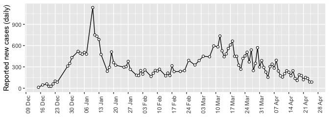
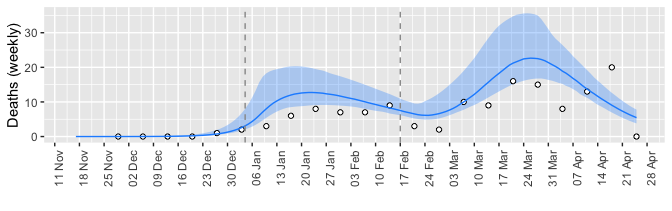
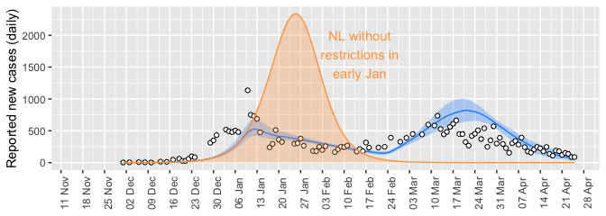
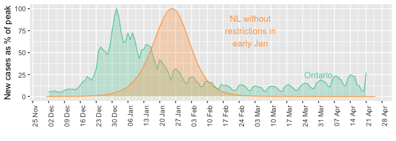

## {-}

The Omicron wave in Newfoundland and Labrador has two peaks.

The mid-February low in reported cases is matched by a dip in both hospitalizations and weekly deaths, and so all three data sources agree: cases reached a low in mid-February, separating peaks in January and March.



### Why does Newfoundland and Labrador have a two-peaked BA.1 wave?

Even when fitting to the hospitalizations and deaths only, a good fit is only possible assuming that restrictions impacted the transmission rate.

I have specified the dates, but the values are fitted to the hospitalization and death data:


```
##        dates transmission.rate
## 1     before              0.59
## 2 2022-01-04              0.22
## 3 2022-02-17              0.59
```

The transmission rate is the number of infections per day per infected person. The date of January 4, 2022, is selected to match the move to [Alert level 4](https://www.gov.nl.ca/releases/2022/health/0103n02/), and February 17, 2022, is selected to match the beginning of [phased re-opening](https://www.gov.nl.ca/releases/2022/health/0217n04/).

In reality, both the escalation and relaxation of restrictions was layered, however, these two dates give a good fit and correspond to public health decisions.

Due to epidemiological model that was fit the lows in hospital occupancy and weekly deaths lag behind the timing of the change in the transmission rate.




### What if there were no public health restrictions in early January?

Redoing the modelling, but without the decreased transmission rate on January 4, Newfoundland and Labrador would have experienced a BA.1 wave with few reported cases by mid-February, hospital occupancy dropping below 10 on March 31, and weekly deaths below 5 on March 3.

The restrictions may have prolonged the BA.1 wave, but notably, without the restrictions, hospital occupancy might have peaked at around 80.



Without the restrictions in early January, the shape of the BA.1 wave might have been similar to Ontario, although with a different maximum value, and delayed in arriving by about 3 weeks.



Without the restrictions in early January, during the BA.1 wave there would have been 11% more deaths and 8.5% more cases. 


```
##       Quantity        Scenario Value
## 1  total cases          actual 45535
## 2  total cases no restrictions 50660
## 3 total deaths          actual   188
## 4 total deaths no restrictions   204
```

(note that `actual` is a model fitted estimate based on the fitting to the actual data)
