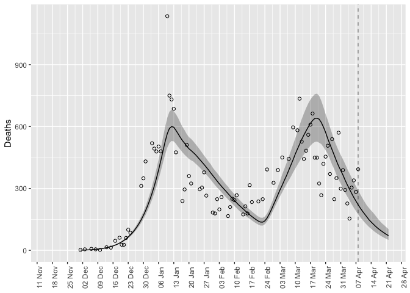
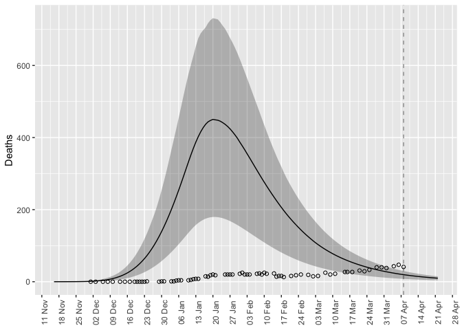
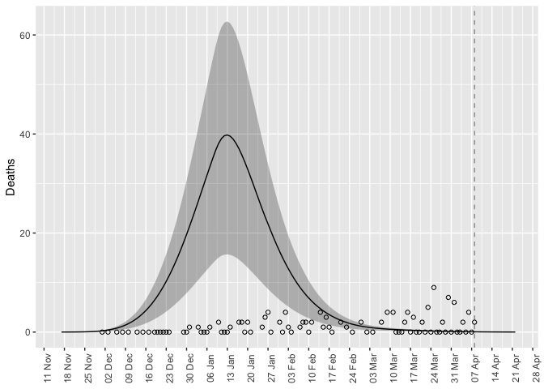

```r
plot_forecast(fitted_data, "report", observed_data) +
  ylab("Deaths")+ scale_x_date(date_breaks = "7 day", date_labels = "%d %b")+
  theme(axis.text.x = element_text(angle = 90),legend.position = "none")
```

```
## Warning: Removed 15 row(s) containing missing values (geom_path).
```

<!-- -->

```r
plot_forecast(fitted_data, "H", observed_data) +
  ylab("Deaths")+ scale_x_date(date_breaks = "7 day", date_labels = "%d %b")+
  theme(axis.text.x = element_text(angle = 90),legend.position = "none")
```

```
## Warning: Removed 16 rows containing missing values (geom_point).
```

<!-- -->

```r
plot_forecast(fitted_data, "death", observed_data) +
  ylab("Deaths")+ scale_x_date(date_breaks = "7 day", date_labels = "%d %b")+
  theme(axis.text.x = element_text(angle = 90),legend.position = "none")
```

```
## Warning: Removed 1 row(s) containing missing values (geom_path).
```

<!-- -->
